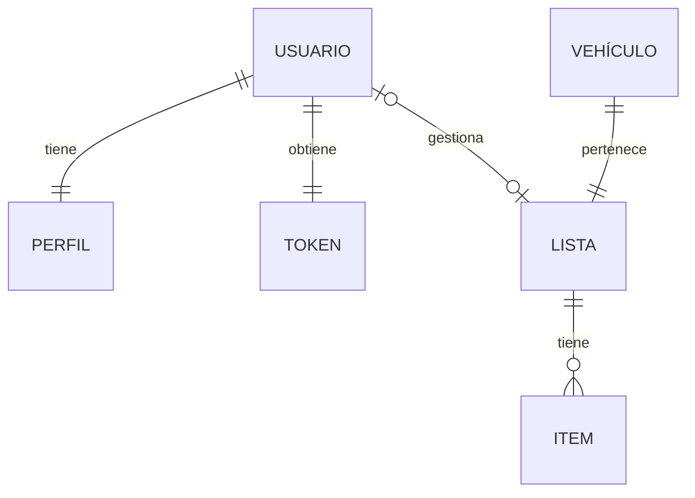
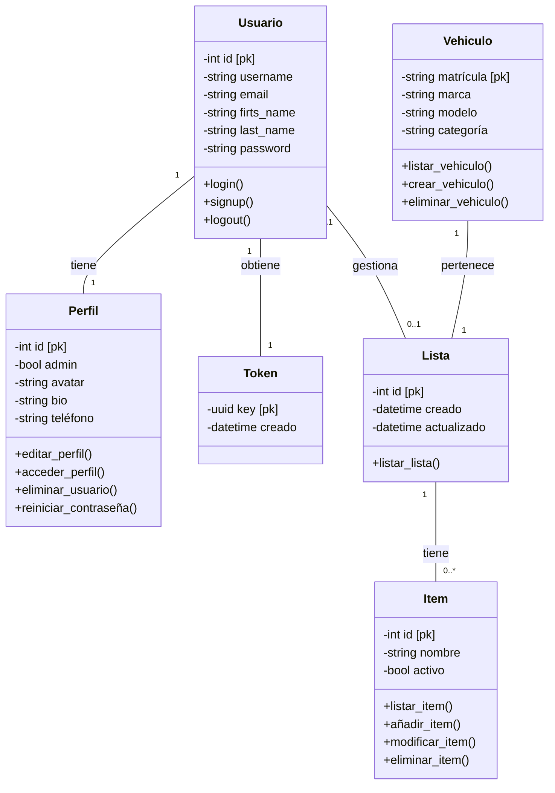

Este es el modelo de la base de datos a implementar en el proyecto, se mostrará el modelo de datos y el diagrama de clases.

Los datos están almacenados en un sistema de gestión de base de datos SQL con Sqlite3

## Modelo de Datos

## Diagramas

