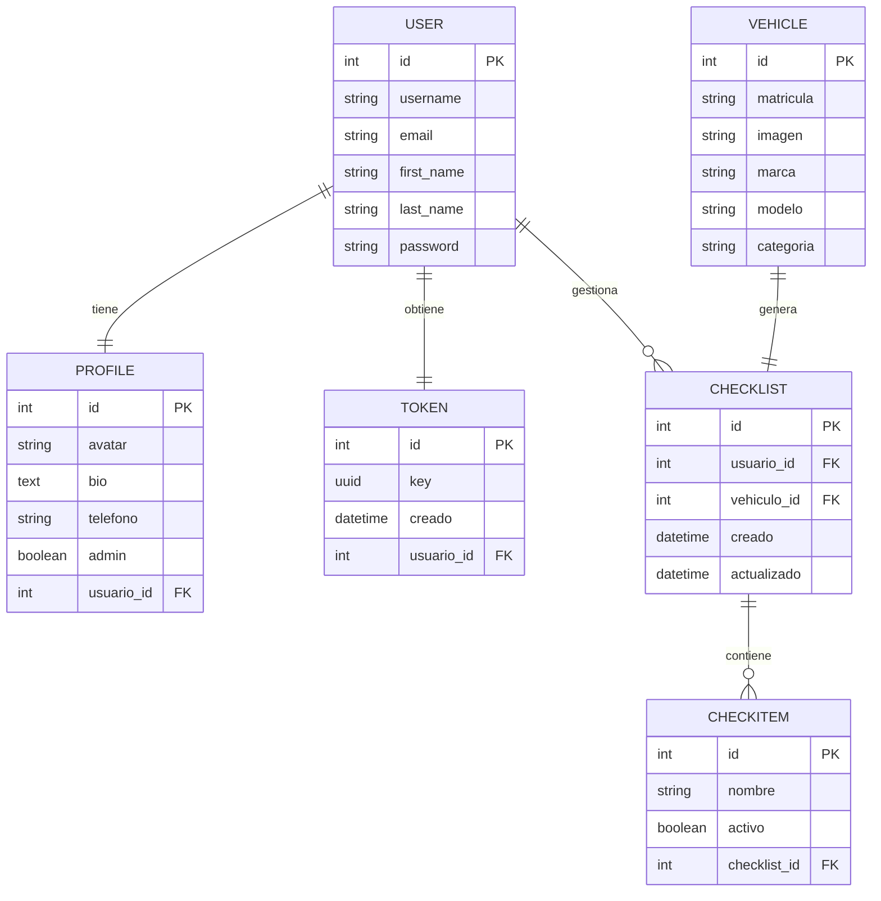
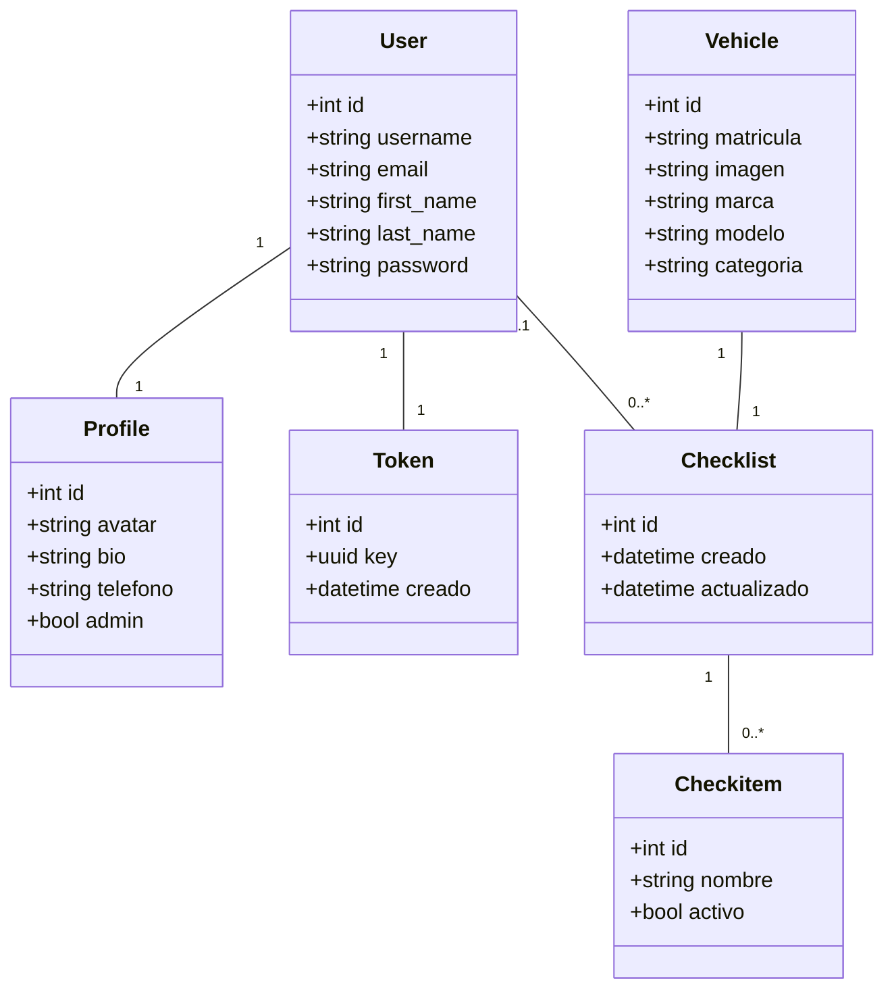

# Base de Datos

EmergenTory utiliza Django ORM sobre SQLite en desarrollo. La base de datos local se encuentra en `apps/api/db.sqlite3`.

Los modelos principales están repartidos en tres aplicaciones Django:

- `users`: perfiles y tokens.
- `vehicles`: vehículos.
- `checklists`: listas de revisión e items.

## Modelo de Datos

## Entidades

### Usuario

Se usa el modelo estándar de Django (`AUTH_USER_MODEL`). Guarda las credenciales y datos básicos:

| Campo | Descripción |
| --- | --- |
| `username` | Identificador de acceso. |
| `email` | Correo electrónico. |
| `first_name` | Nombre. |
| `last_name` | Apellido. |
| `password` | Contraseña hasheada por Django. |

### Profile

Extiende al usuario con datos propios de la aplicación.

| Campo | Tipo | Descripción |
| --- | --- | --- |
| `avatar` | `ImageField` | Imagen del perfil. Por defecto usa `avatars/noavatar.png`. |
| `bio` | `TextField` | Texto libre opcional. |
| `telefono` | `CharField` | Teléfono opcional validado por expresión regular. |
| `admin` | `BooleanField` | Define permisos de administración. |
| `usuario` | `OneToOneField` | Relación uno a uno con el usuario. |

Se crea automáticamente al crear un usuario.

### Token

Token propio de autenticación.

| Campo | Tipo | Descripción |
| --- | --- | --- |
| `key` | `UUIDField` | UUID único usado como Bearer Token. |
| `usuario` | `OneToOneField` | Usuario propietario del token. |
| `creado` | `DateTimeField` | Fecha de creación. |

Se crea automáticamente al crear un usuario.

### Vehicle

Representa un vehículo de emergencia.

| Campo | Tipo | Descripción |
| --- | --- | --- |
| `matricula` | `CharField` | Matrícula única. Debe cumplir el formato español validado por señal. |
| `imagen` | `ImageField` | Imagen del vehículo. |
| `marca` | `CharField` | Marca, máximo 200 caracteres. |
| `modelo` | `CharField` | Modelo, máximo 200 caracteres. |
| `categoria` | `CharField` | `POL`, `AMB` o `BOM`. |

Al crear un vehículo se genera automáticamente una checklist asociada.

### Checklist

Lista de revisión asociada a un vehículo.

| Campo | Tipo | Descripción |
| --- | --- | --- |
| `usuario` | `ForeignKey` | Usuario que gestiona la lista. Puede quedar vacío. |
| `vehiculo` | `OneToOneField` | Vehículo asociado. |
| `creado` | `DateTimeField` | Fecha de creación. |
| `actualizado` | `DateTimeField` | Fecha de última modificación. |

### Checkitem

Elemento individual dentro de una checklist.

| Campo | Tipo | Descripción |
| --- | --- | --- |
| `nombre` | `CharField` | Nombre del elemento, máximo 255 caracteres. |
| `activo` | `BooleanField` | Indica si el elemento está marcado. |
| `checklist` | `ForeignKey` | Checklist a la que pertenece. |

## Señales Automáticas

La aplicación usa señales de Django para mantener relaciones obligatorias:

- Al crear un usuario se crean su `Profile` y su `Token`.
- Al crear un vehículo se crea su `Checklist`.
- Antes de guardar un vehículo se valida la matrícula con el patrón `0000BBB`, permitiendo opcionalmente espacio o guion entre números y letras.

## Diagrama de Clases

